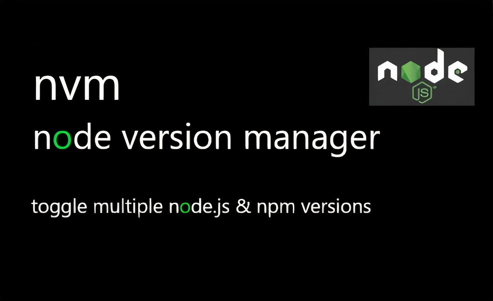

Have you ever been in a situation where you have to support an old or special project (works only with a certain version of Node.js) with a legacy node.js version, and at the same time, have to work on new projects with the latest version of Node.js?

I had the same issue where I had to use Node.js 8.9.0 (Carbon) and the latest version for my React JS project. Well, this is where NVM comes into the action.

> The version of NVM I am going to write about is Windows-specific only. If you are looking for Mac/Linux nvn, please follow this [link](https://github.com/nvm-sh/nvm).

NVM (Node.js version manager for Windows) can be downloaded from [here](https://github.com/coreybutler/nvm-windows/releases)

## What nvm does?

It let's install a specific or latest version of node.js & corresponding npm directly from the command line and let us switch between different version of node.js.

## Where do I get it from?

Download **nvm-setup.zip**, unzip and then install it.

## How do I use it?

Once installed, you can check any installed version of node.js:

```
C:\Users\rames>nvm list
  * 12.14.0 (Currently using 64-bit executable)
C:\Users\rames>
```

The asterisk (\*) on the left-hand side denotes the version of node.js that is being used.

Available commands can be seen by command:
`C:\Users\rames>nvm --help`

Above command shows nvm version as well as available nvm commands.

## Install a version of Node.js

The syntax to install node.js is _nvm install <version> [arch]_ where <verion> is the needed version and [arch] is 32-or64-bit

```
C:\Users\rames>nvm install 8.9.0 [64]
Downloading node.js version 8.9.0 (64-bit)...
Complete
Creating C:\Users\rames\AppData\Roaming\nvm\temp
Downloading npm version 5.5.1... Complete
Installing npm v5.5.1...
Installation complete. If you want to use this version, type
nvm use 8.9.0
```

It installs Node.js and corresponding version of _npm_.

Now, command nvm list will show the following:

```
  * 12.14.0 (Currently using 64-bit executable)
    8.9.0
```

## How to switch between versions?

It's dead easy. Just type:

```
C:\Users\rames>nvm use 8.9.0
Now using node v8.9.0 (64-bit)
```

Let's verify the version of Node.js & npm:

```
C:\Users\rames>node --version
v8.9.0
C:\Users\rames>npm --version
5.5.1
```

Now, we can easily switch between Node.js version, thanks to the author (and many contributors) of the project :-).
If you love it, don't forget to give the project a star in the project's Github [repository](https://github.com/coreybutler/nvm-windows).

> CAUTION: Remember to choose the right version of Node.js as it might throw some very cryptic error messages.
