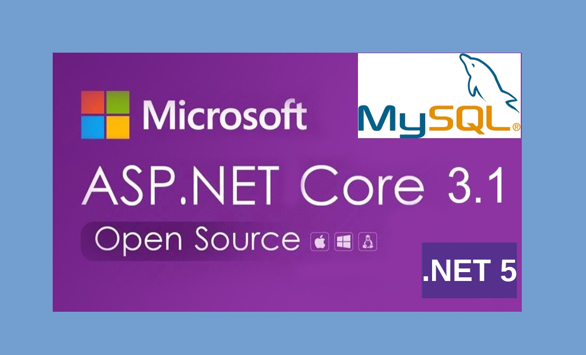

Possibility of using MySQL (or MariaDB) with .Net Core opens an opportunity to use open-source free database. Moreover, one can take advantage of .Net Core or .Net 5 being cross-platform by bypassing all Microsoft's paid services! Yes, Linux hosting with one of the open-source free database.

> MySQL is technically an open-source database. However, under Oracle, MySQL now has proprietary, closed-source modules. MariaDB, being a MySQL fork, is a good alternative. MariaDB 5.5 offers all of the MySQL 5.5 features[^1].

In this post, I will show how we can use _Entity Framework 5.0 Code First_ approach to create tables in a MySQL database.

## Project setup

The advantage of using .Net Core again is use of light-weight Visual Studio Code (perhaps one of the best open-source free code editor) with millions of plugins. Great for Linux as Visual Studio is available only for Windows and Mac. I will be using Visual Studio 2019 Community Edition (free) and MySQL 5.7.

We will be using **dotnet new** command to scaffold builtin template. It can also be done using GUI in Visual Studio.

1. Create a folder for the project.
2. Open command prompt, and go to the folder.
3. Type `dotnet new --list` . It shows a list of available templates.
4. We will be using _ASP.NET CORE Web API_ template targeting .Net Core 3.1.
5. Type `D:\DotNetCoreMySQL>dotnet new webapi --framework netcoreapp3.1`. Check [here](https://docs.microsoft.com/en-us/dotnet/core/tools/dotnet-new#template-options) for more template version.
6. The command will create a project in the given folder. Remember, it does NOT create a Solution like Visual Studio does. One need to run a command explicitly to create solution. I will be skipping it.

> This post assumes all the dependencies are installed. .NET Core SDK or Runtime (at least 3.1) (can check installed version using `dotnet --version`), MySQL and Visual Studio or Visual Studio Code (prepare to write more code).

Go to the project folder, right-click PROJECT_NAME.csproj file, and choose 'Open With Visual Studio'

## Install Entity Framework Core 5.0

Again, we can install package from Nuget using Visual Studio GUI. However, it's handy to do using CLI in Package Manager Console.

_Tips: Open nuget.org so that we can copy CLI from there_

1. Go to nuget.org and search EF Core or follow this [link](https://www.nuget.org/packages/Microsoft.EntityFrameworkCore/)
2. Click Package Manager tab, and click _copy_ icon on right-hand side.
3. Pase it in Visual Studio's Package Manager Console.
4. Install EntityFrameworkCore Design from [here](https://www.nuget.org/packages/Microsoft.EntityFrameworkCore.Design/)
5. We also need EF Core Command Line Tools to create migrations, update the database, etc. It's installed on global scope. First check if it's installed by `dotnet ef`. If you don't see text EF with Unicorn followed by options then we need to [install](https://www.nuget.org/packages/dotnet-ef/) it on **command prompt** by `dotnet tool install --global dotnet-ef --version 5.0.1`

## Install Entity Framework Core provider for MySQL

We will be using [Pomelo](https://github.com/PomeloFoundation/Pomelo.EntityFrameworkCore.MySql) provider over [MySql.Data.EntityFrameworkCore](https://www.nuget.org/packages/MySql.Data.EntityFrameworkCore). The latter one is official MySQL provider, however, I did not have a good experience with it, so my choice is Pomelo.

1. Get the latest (alpha.2) version from [here](https://www.nuget.org/packages/Pomelo.EntityFrameworkCore.MySql/5.0.0-alpha.2)
2. Paste the copied code to Package Manager Console.

## Create a database in MySQL (I use MySQL Workbench)

I am not going to show guidelines regarding creating a database and a user in MySQL. MySQL Workbench cannot be compared with SQL Server Management Studio but quite easy to use.

1. I am using a database **mysqldotnet** and a user **mysqldotnetuser** for this database in this example.

[^1]: https://mariadb.com/kb/en/changes-improvements-in-mariadb-55/

## Create a model to generate a table.

1. Create a folder Models at the root of the project.
2. Add a class to the folder, let say _User_
3. Now, let's define our model.

> By default, EF Core will pluralize the generated table name. For example, User will be mapped as Users in the database. To have singularize name, decorate class with the attribute ` [Table("User")]`

```
    [Table("User")]
    public class User
    {
        [Key]
        [DatabaseGenerated(DatabaseGeneratedOption.Identity)]
        public int Id { get; set; }

        [Required]
        [MaxLength(50)]
        public string FirstName { get; set; }

        [Required]
        [MaxLength(50)]
        public string LastName { get; set; }

        [Required]
        [MaxLength(250)]
        public string Address { get; set; }

        [Required]
        [MaxLength(50)]
        public string Country { get; set; }

        [MaxLength(15)]
        public int Mobile { get; set; }
    }
```

## DBContext
